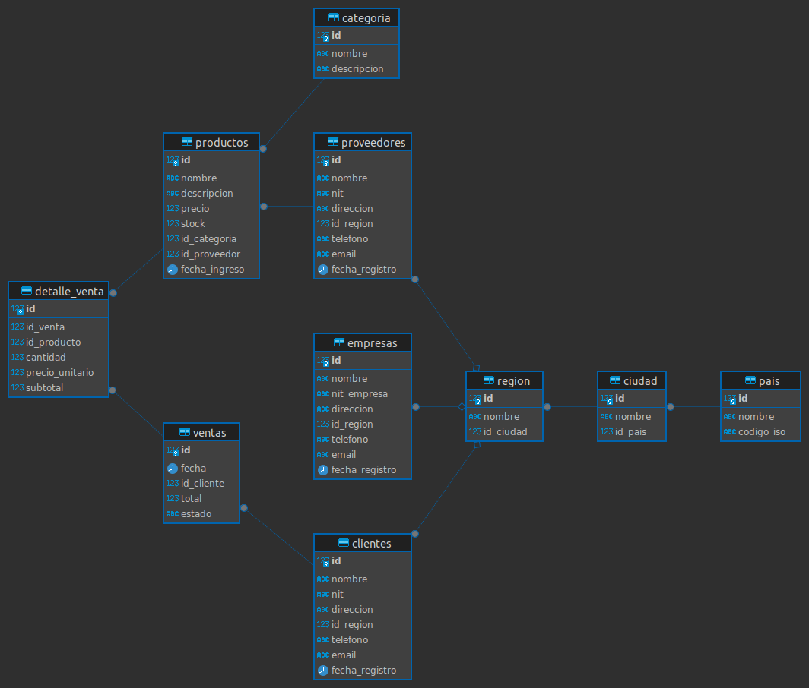

# Sistema de Gestión de Ventas TechZone

## Descripción del Proyecto
TechZone es un sistema de gestión de ventas diseñado para una tienda de productos tecnológicos. El sistema permite gestionar de manera eficiente el inventario, las ventas, los clientes y los proveedores. Incluye funcionalidades para:

- Control de inventario y stock
- Gestión de ventas y transacciones
- Seguimiento de clientes
- Administración de proveedores
- Análisis de ventas y reportes

## Modelo Entidad-Relación


## Estructura de Archivos
El proyecto está organizado en los siguientes archivos SQL:

1. **db.sql**: Contiene la estructura de la base de datos
   - Creación de tablas
   - Definición de relaciones
   - Restricciones y validaciones
   - Índices para optimización

2. **insert.sql**: Script para insertar datos iniciales
   - Datos de prueba
   - Registros de ejemplo
   - Configuración inicial

3. **queries.sql**: Consultas de ejemplo
   - Consultas de análisis
   - Reportes de ventas
   - Estadísticas de productos

4. **procedure.sql**: Procedimientos almacenados
   - Función de registro de ventas
   - Validaciones de stock
   - Verificación de clientes

## Instalación y Configuración

### Requisitos Previos
- PostgreSQL 12 o superior
- Acceso de superusuario a la base de datos

### Pasos de Instalación

1. **Crear la base de datos**:
```sql
psql -U postgres -c "CREATE DATABASE techzone;"
```

2. **Importar la estructura**:
```sql
psql -U postgres -d techzone -f db.sql
```

3. **Importar datos iniciales**:
```sql
psql -U postgres -d techzone -f insert.sql
```

4. **Importar procedimientos**:
```sql
psql -U postgres -d techzone -f procedure.sql
```

## Ejemplos de Uso

### Consultas Básicas

1. **Ver productos con stock bajo**:
```sql
SELECT id, nombre, stock
FROM productos
WHERE stock < 5;
```

2. **Calcular ventas del mes**:
```sql
SELECT 
    DATE_TRUNC('month', fecha) AS mes,
    SUM(total) AS ventas_totales
FROM ventas
WHERE fecha >= '2024-03-01' AND fecha < '2024-04-01'
GROUP BY DATE_TRUNC('month', fecha);
```

## Estructura de la Base de Datos

### Tablas Principales

1. **productos**
   - Información de productos
   - Control de inventario
   - Precios y categorías

2. **clientes**
   - Datos de clientes
   - Historial de compras
   - Información de contacto

3. **ventas**
   - Registro de transacciones
   - Totales y fechas
   - Estado de la venta

4. **detalle_venta**
   - Productos vendidos
   - Cantidades y precios
   - Subtotales

5. **proveedores**
   - Información de proveedores
   - Productos suministrados
   - Datos de contacto
